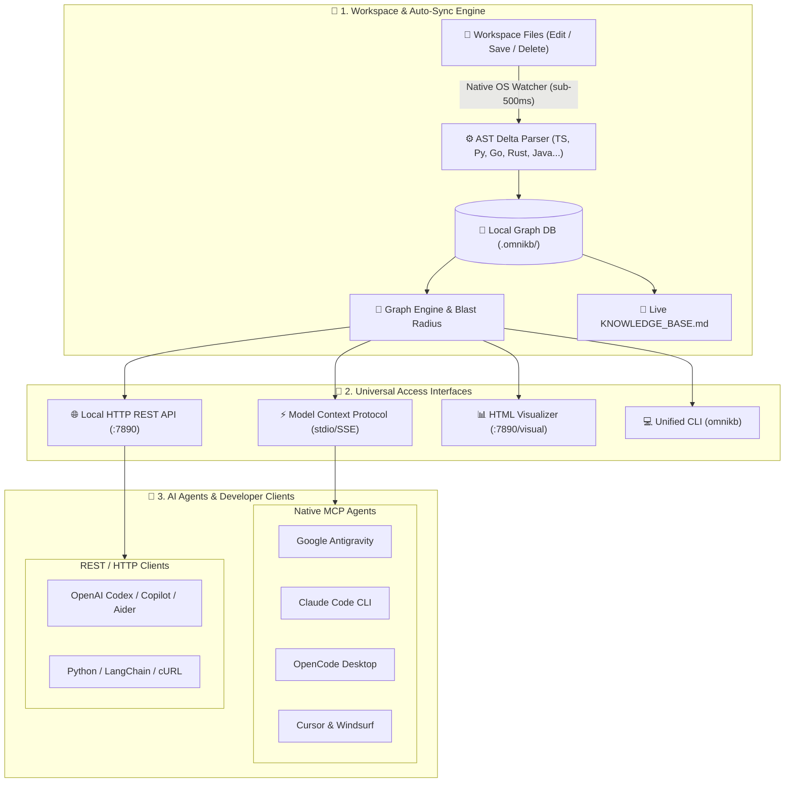

<div align="center">

# 🌐 OmniKB

### Universal Real-Time Code Knowledge Base & Graph Intelligence Engine
**Auto-Sync (<500ms) · Zero-Server Graph RAG · 90% Token Reduction · Universal Multi-Agent MCP**

[](LICENSE)
[](https://nodejs.org)
[](https://modelcontextprotocol.io/)
[](CONTRIBUTING.md)

</div>

---

## 💡 Overview

**OmniKB** is a local, high-speed, pre-indexed code knowledge base and Graph RAG engine designed to provide instant architectural context to **any AI Agent or IDE** (**Google Antigravity, Claude Code, OpenCode Desktop, OpenAI Codex, Cursor, Windsurf, Copilot, LangChain, and custom LLM workflows**).

By pre-indexing ASTs, call graphs, and dependency flows into an incremental local store, OmniKB eliminates **Context Bloat**—reducing AI token consumption by up to **90%** and preventing LLM hallucination during large-scale code exploration and refactoring.

### 🧬 Integrated Intelligence Ecosystem
OmniKB synthesizes the architectural strengths of four industry-leading open-source repositories:

| Core Engine | Origin Repository | Primary Capability in OmniKB |
| :--- | :--- | :--- |
| ⚡ **`codegraph`** | [colbymchenry/codegraph](https://github.com/colbymchenry/codegraph) | Native OS file watcher, debounced auto-sync (<500ms), and surgical 1-step symbol context retrieval. |
| 🕸️ **`GitNexus`** | [abhigyanpatwari/GitNexus](https://github.com/abhigyanpatwari/GitNexus) | Zero-server client-side Graph RAG, multi-hop execution flow traversal, and blast radius risk evaluation. |
| 📊 **`graphify`** | [Graphify-Labs/graphify](https://github.com/Graphify-Labs/graphify) | God Node detection (high coupling hubs), centrality scoring, and standalone interactive D3/SVG graph visualizer. |
| 🎯 **`context7`** | [upstash/context7](https://github.com/upstash/context7) | Dynamic documentation injection, version-aware schema resolution, and prompt context formatting. |

---

## 🏛️ System Architecture



---

## ⚡ Key Features

- 🔄 **Real-Time Debounced Auto-Sync**: Automatically detects file modifications, parses AST deltas, and updates the knowledge graph in `<500ms` without re-indexing the entire workspace.
- 🎯 **Surgical Context Retrieval (`kb_explore`)**: Pulls exact function/class definitions, verbatim code lines, inbound callers, and outbound callees in **1 single call** instead of reading 15 full files.
- 💥 **Blast Radius & Refactoring Risk (`kb_impact`)**: Computes upstream dependency cascades, affected HTTP routes, and numerical risk scores (`LOW`, `MEDIUM`, `HIGH`, `CRITICAL`) before code changes are made.
- 🌐 **Dynamic Multi-Project Switching**: Automatically detects when you switch workspaces in your IDE, seamlessly re-pointing and watching the active project.
- 🔌 **Universal Multi-Agent Access**: Stdio MCP server, REST API on port `7890`, standalone interactive D3/SVG browser graph, and continuous `KNOWLEDGE_BASE.md` markdown generation.
- 🔒 **100% Local & Privacy-Preserving**: Runs completely on your machine with zero external server dependencies, zero telemetry, and zero data leakage.

---

## 📊 Token Efficiency Benchmarks

| Task | Traditional Agent Approach (Full-File Dumps) | OmniKB Surgical Graph Approach | Token Reduction |
| :--- | :--- | :--- | :--- |
| **Codebase Exploration** | ~40,000 tokens (8–15 full files) | ~1,500 tokens (surgical caller/callee context) | **~96% Saved** |
| **Refactoring Blast Radius** | ~60,000 tokens (manual grep + review) | ~3,000 tokens (graph dependency cascade) | **~95% Saved** |
| **Symbol & Interface Lookup** | ~20,000 tokens (broad search) | ~400 tokens (inverted index match) | **~98% Saved** |
| **Average 1 Coding Session** | **~120,000 tokens** | **~10,000 tokens** | **~91% Saved** |

---

## 🚀 Quick Start

### 1. Installation

```bash
# Clone the repository
git clone https://github.com/ashhstr/omnikb.git
cd omnikb

# Install dependencies and build
npm install
npm run build
```

### 2. Initialize a Project

```bash
# Run initial index scan on any project directory
node dist/cli.js init /path/to/your/project
```

### 3. Start the Universal Server

```bash
# Starts watcher + REST API + MCP stdio server
node dist/cli.js serve /path/to/your/project --port 7890
```

- **REST API**: `http://127.0.0.1:7890`
- **Interactive Visualizer**: `http://127.0.0.1:7890/visual`
- **Live Markdown**: `KNOWLEDGE_BASE.md`

---

## 🔌 Multi-Agent Integration Guide

### 1. Google Antigravity
Add to your Antigravity MCP settings (`mcp.json`):
```json
{
  "mcpServers": {
    "omnikb": {
      "command": "node",
      "args": ["path/to/omnikb/dist/cli.js", "serve", "--mcp"]
    }
  }
}
```

### 2. Claude Code CLI
Register OmniKB globally via CLI:
```bash
claude mcp add omnikb node path/to/omnikb/dist/cli.js serve --mcp
```
Or add to `~/.claude.json`:
```json
{
  "mcpServers": {
    "omnikb": {
      "command": "node",
      "args": ["path/to/omnikb/dist/cli.js", "serve", "--mcp"]
    }
  }
}
```

### 3. OpenCode Desktop
1. Open **Settings** $\rightarrow$ **MCP** in OpenCode Desktop.
2. Add a new **Stdio** server:
   - **Command**: `node`
   - **Args**: `path/to/omnikb/dist/cli.js`, `serve`, `--mcp`

### 4. Cursor / Windsurf / VS Code
Add to `.cursor/mcp.json` or `.vscode/mcp.json`:
```json
{
  "mcpServers": {
    "omnikb": {
      "command": "node",
      "args": ["path/to/omnikb/dist/cli.js", "serve", "--mcp"]
    }
  }
}
```

### 5. OpenAI Codex / Copilot / ChatGPT / LangChain (REST API)
Point your agent scripts or function callers to the local HTTP REST API:
```bash
# Explore symbol verbatim definition + callers/callees
curl -X POST http://127.0.0.1:7890/v1/explore \
  -H "Content-Type: application/json" \
  -d '{"query": "parseFile", "maxDepth": 3}'

# Calculate blast radius before refactoring
curl -X POST http://127.0.0.1:7890/v1/impact \
  -H "Content-Type: application/json" \
  -d '{"target": "KnowledgeStorage", "maxDepth": 5}'
```

---

## 🛠️ MCP Tools Reference

| MCP Tool | Description | Key Parameters |
| :--- | :--- | :--- |
| **`kb_explore`** | Retrieves verbatim code definition, call paths, callers, and callees in 1 step. Supports dynamic full-file drilldown to prevent LLM context compaction loss. | `query` *(string)*, `maxDepth` *(number, default: 3)*, `includeFullFile` *(boolean, default: false)*, `includeImports` *(boolean, default: false)* |
| **`kb_impact`** | Evaluates blast radius, upstream dependents, and breaking risk score. | `target` *(string)*, `maxDepth` *(number, default: 5)* |
| **`kb_search`** | Inverted index full-text search across all symbols and documentation. | `query` *(string)*, `limit` *(number, default: 20)* |
| **`kb_architecture`** | Returns total graph metrics, God Nodes (hotspots), and registered API routes. | *(none)* |
| **`kb_status`** | Returns active workspace directory, watcher status, and pending sync queue. | *(none)* |
| **`kb_switch_project`** | Dynamically switches and indexes a new workspace on the fly. | `projectPath` *(string)* |

---

## 💻 CLI Commands Reference

```bash
# Initialize knowledge base for a directory
omnikb init [directory]

# Start auto-sync watcher
omnikb watch [directory]

# Start universal server (Watcher + REST API + MCP)
omnikb serve [directory] [--port 7890] [--mcp]

# Explore symbol context
omnikb explore <symbol_name>

# Check blast radius and affected files
omnikb impact <symbol_or_file>

# Inverted token search
omnikb search <query>

# Regenerate KNOWLEDGE_BASE.md report
omnikb report [directory]

# Regenerate .omnikb/graph.html visualizer
omnikb visual [directory]
```

---

## 🧪 Testing

OmniKB includes an automated verification test suite:

```bash
npm test
```

Verifies:
1. Multi-language AST parsing (TypeScript, JavaScript, Python, Go, Rust, Java, C++, Markdown)
2. Inverted index & token retrieval
3. Graph engine & upstream blast radius calculation
4. Live Markdown & standalone D3 visualizer generation
5. Incremental delta auto-sync (<500ms)
6. Dynamic multi-project workspace switching

---

## 📜 License

This project is licensed under the [MIT License](LICENSE).

---

<div align="center">
Built with ❤️ by <a href="https://github.com/ashhstr">Ash</a> for the Global AI & Developer Community.
</div>
